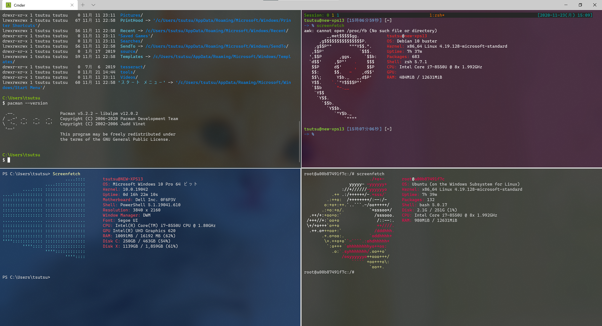
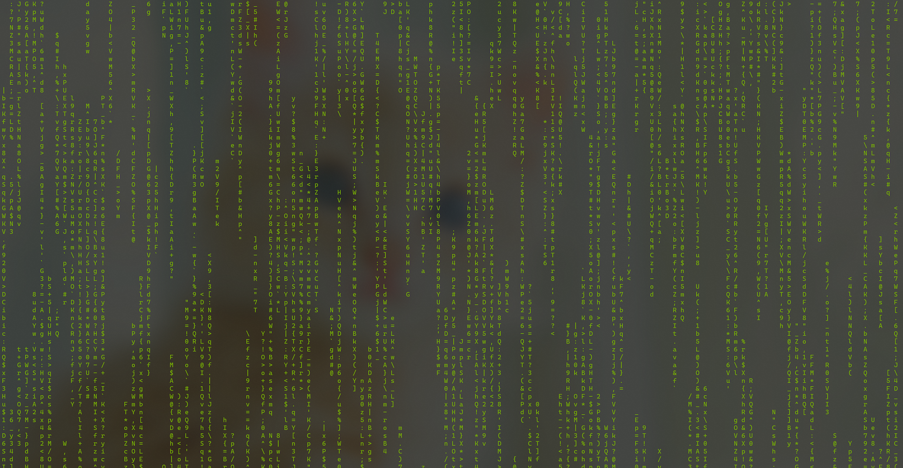
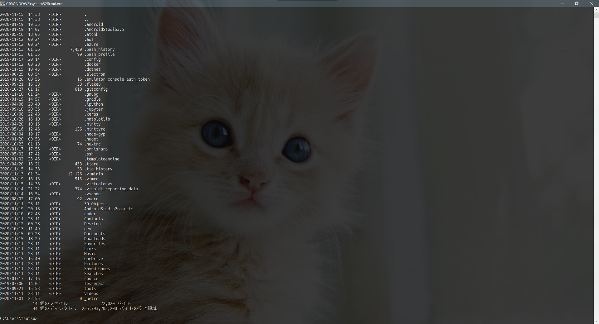
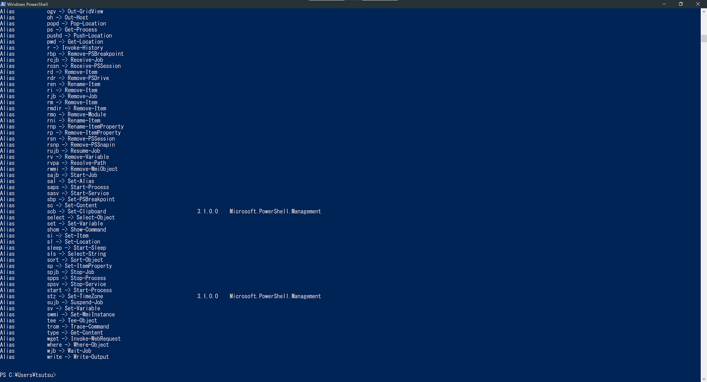
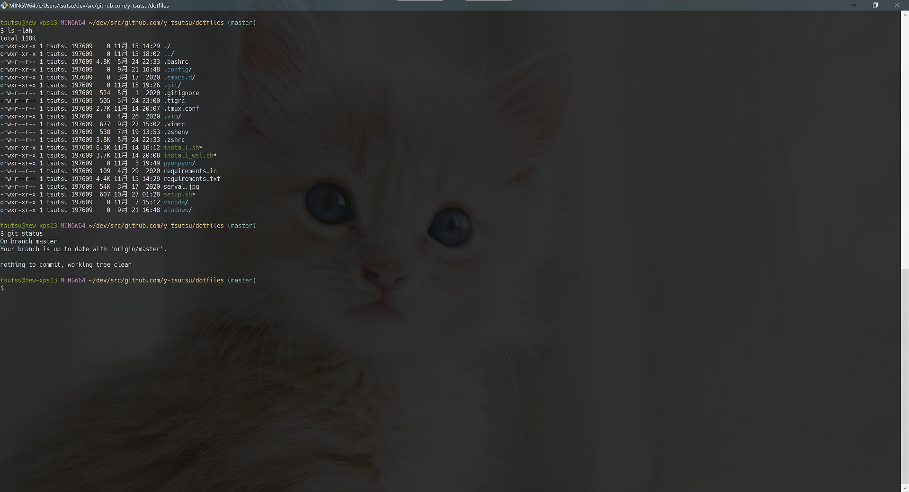
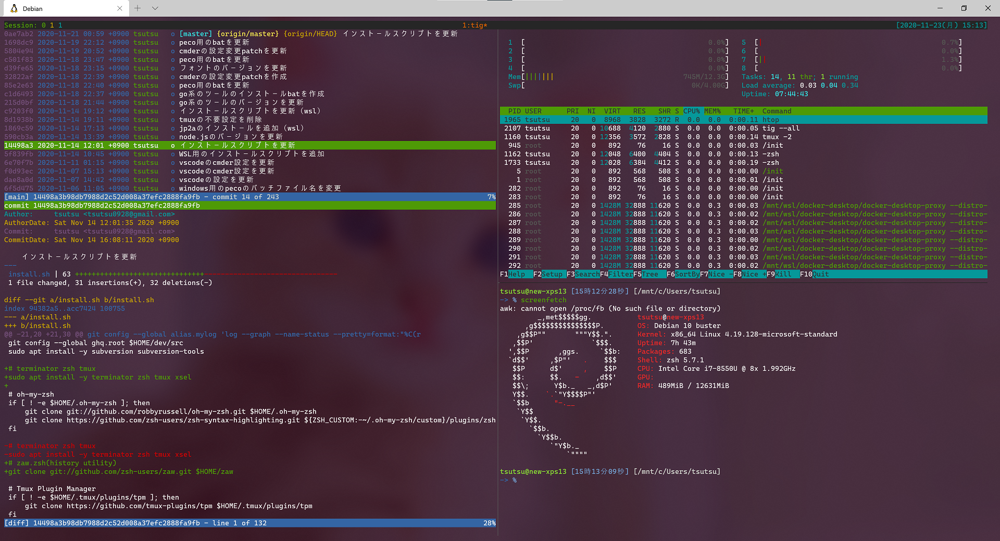
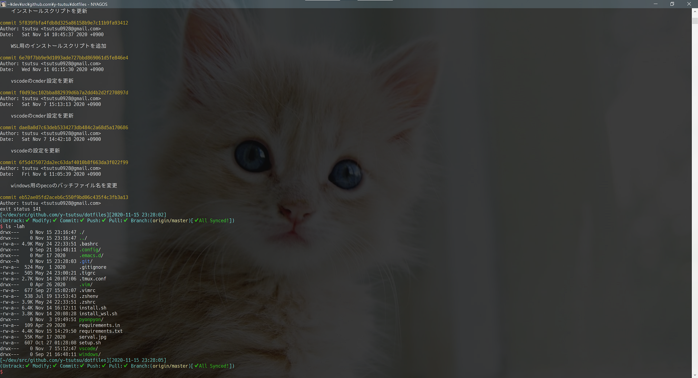
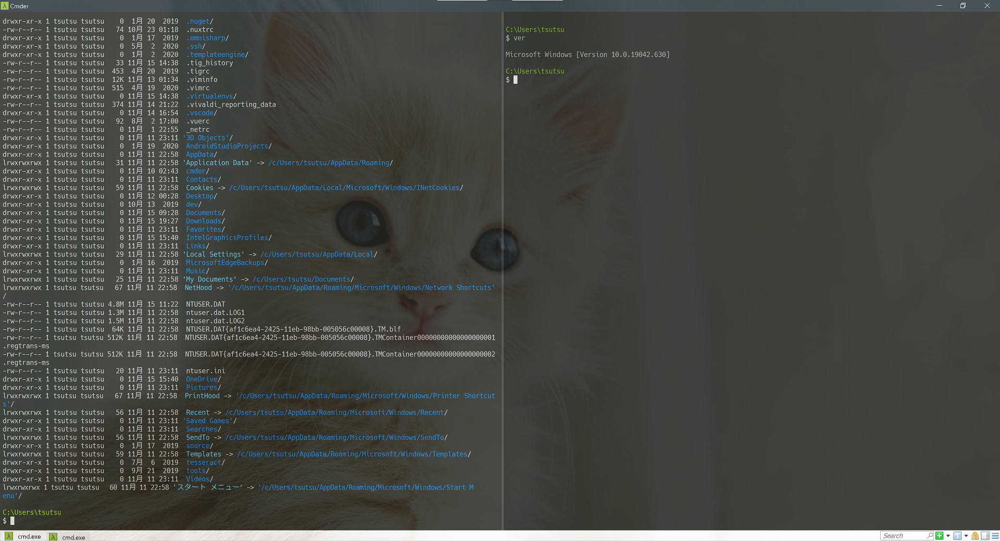
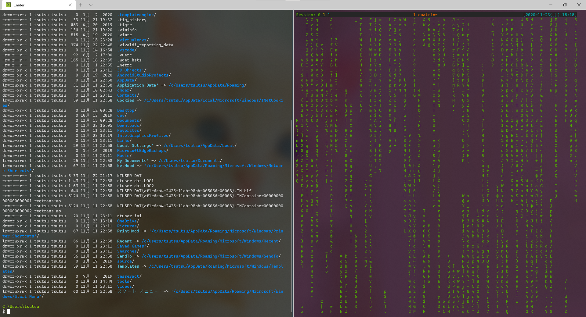

<!--
_class: lead invert
-->

# Windowsの**ターミナル**環境紹介

---

## Windowsに**ターミナル**は必要？

Windowsでも開発においてCLIを使うことも多いです．
WSL，Docker，Git，Python，Node.js，Go，etc．．．
作業の効率化や自動化に向いています．

**ターミナル**が便利に使えるとやれることが増えます．
あとプログラマーっぽくてかっこいい．

Windowsで使える**ターミナル**（**シェル**）を簡単に紹介します．

---

## コマンドプロンプト（**cmd**）

昔からあるやつ．古いしこれをそのまま使うのはおすすめしない．

でもだいぶ使いやすくなった．
ウィンドウのサイズ変更や文字の選択，コピペもやりやすくなった．

ただ補完も効かないし，文字も真っ白で使いづらい．

---

## PowerShell（**powershell**・**pwsh**）

オブジェクト指向なMicrosoft製のシェル，スクリプト言語．
ドットでチェーンする代わりにパイプでつないで書くことができる．
また簡潔に書くためのエイリアスがたくさん用意されている．
UNIXのコマンドも，同機能のコマンドレットにエイリアスをつけて用意されている．補完もよく効いて使いやすい．

Powerlineを使って見た目をかっこよくすることもできる．

コマンドプロンプトをそのまま使うくらいなら，PowerShellを使えばいいと思う．

---

## Git Bash（**git-bash**）

Git for Windowsをインストールすると使える**Bash**環境．
ターミナルは**mintty**を使用している．
lsやcdの他にgrepやfindなどのUNIXコマンドも使える．

Gitをインストールするだけで入ってくるので導入が簡単．

WindowsのコマンドよりUNIXのコマンドを主に使ったり，Gitの操作がメインな場合は使いやすいと思う．
batファイルなどとは相性が悪い．

---

## WSL2(**Windows Subsystem for Linux**)

Windows 10上でLinuxを動作させるための仕組み．（バージョン2）
WSL2ではHyper-Vを利用してLinuxカーネルそのものが動作してる．

軽量かつ高速にLinuxを動作させることができる．

LinuxからWindowsのファイルシステムにアクセスしたり，またその逆を行うこともできる．（速度面などのオーバーヘッドは大きい）
ただ，例えばWindows側のソースコードをWSL上のGitを使って操作するなどは，有効に行えそう．

---

## NYAGOS（**NYAOS**）

Goで書かれたWindows用のシェル．Luaで拡張できる.

History機能や補完機能が充実している．
Windows標準のコマンドラインとの互換性が高く，そこにUNIXライクな操作を行うことができる．

手軽にWindowsのコマンドプロンプトを強化したような環境を構築することができておすすめ．

---

## Cmder（**ConEmu**・**Clink**・**Git for Windows**）

コマンドプロンプト（Clink），PowerShell，Bash，WSLなどの各種シェル等と組み合わせて使うことができる．
Clinkと組み合わせて使うと，NYAGOSと同様にコマンドプロンプトの強化版として使うことができる．

またターミナルアプリも使い勝手がよく，見た目も奇麗でおすすめ．

環境構築も手軽にできて，自分も長く使っていた．

---

## Windows Terminal（**Cascadia Mono**）

Microsoft製のOSSのターミナルアプリ．
WSLの流れで開発されて，今年Ver.1が公開された．
コマンドプロンプト，PowerShell，WSL，Git Bashなどの各種シェルと組み合わせて使うことができる．

画面分割，タブ切り替えに対応しており，コマンドパレットから操作することができて使いやすい．

ストアアプリとして公開されている．

---

## 自分の**ターミナル**環境

- ターミナルはWindows Terminal
- デフォルトのシェルはCmder
- MSYS2とMinGWを導入
- PowerShell，WSL2，Dockerがすぐ使える
- ghq，pecoがおすすめ
- VSCodeのターミナルもCmder
- **Windows Terminal**と**WSL2**で開発環境が快適になった

---

<!--
_class: lead invert
-->

# Thank **You** for Reading :smiley:
